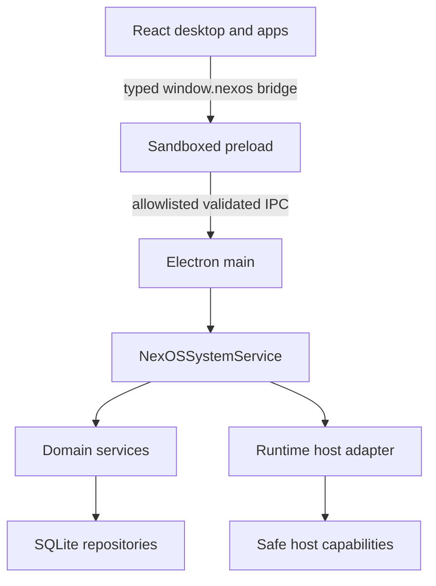

# NexOS architecture

NexOS v0.2 is a desktop operating environment, not a hardware kernel. Electron owns the host process and Chromium renderer; NexOS owns the system-service, virtual filesystem, application, process, permission, window, and user abstractions above that runtime.

## Runtime topology

The renderer never imports Node.js or Electron. It consumes the `NexOSBridge` contract from `@nexos/types`, exposed through a context-isolated preload. Main-process IPC handlers validate every input before dispatching to system services.

## Workspace boundaries

| Area                       | Responsibility                                                                              | Must not do                                    |
| -------------------------- | ------------------------------------------------------------------------------------------- | ---------------------------------------------- |
| `apps/desktop`             | Electron lifecycle, preload bridge, React shell, managed application windows                | Direct SQL from React; expose raw Node.js APIs |
| `apps/system-service`      | Compose accounts, apps, search, settings, notifications, NexAI, storage and domain services | Render UI; depend on browser globals           |
| `packages/types`           | Shared contracts and Zod schemas                                                            | Contain runtime business logic                 |
| `packages/storage`         | SQLite migrations and repositories                                                          | Enforce UI or application policy               |
| `packages/filesystem`      | Virtual filesystem semantics                                                                | Access renderer state                          |
| `packages/process-manager` | Internal process lifecycle and metrics                                                      | Spawn arbitrary native processes               |
| `packages/runtime`         | Versioned binary host protocol, validation, and runtime adapters                            | Expose ambient native authority                |
| `packages/permissions`     | Manifest declarations and per-user grants                                                   | Display permission dialogs                     |
| `packages/window-manager`  | Framework-independent Zustand window state                                                  | Launch Electron windows                        |
| `packages/events`          | Strongly typed in-process events                                                            | Persist event history                          |
| `packages/core`            | Errors, calculator, terminal parser and command engine                                      | Depend on React or Electron                    |
| `packages/sdk`             | Stable application-facing bridge accessor                                                   | Add privileged escape hatches                  |
| `packages/ui`              | Reusable accessible UI primitives                                                           | Own system state                               |
| `packages/config`          | Validated environment configuration                                                         | Read secrets in renderer code                  |

## Startup sequence

1. Electron configures the app data directory and creates one secured `BrowserWindow`.
2. `NexOSSystemService` opens `nexos.sqlite`.
3. Versioned migrations run transactionally.
4. Required virtual filesystem paths and the welcome document are created idempotently.
5. Built-in app manifests are registered idempotently.
6. Account/session state and user settings are loaded.
7. Actual progress events drive the boot screen; the login, setup, lock, or desktop surface is selected.

No artificial boot delay is introduced.

## Application lifecycle

The application registry is authoritative for manifests. Launching an app creates or reuses a NexOS process and then creates a window through the centralized window store. Application UI modules are lazy-loaded. Window close events decrement the owning process window count, and a process stops when its final window closes. Task Manager can request explicit process termination.

Built-in apps run as trusted, lazy-loaded shell modules. Installed `.nxapp` packages use a deliberately constrained declarative runtime; package JavaScript and native binaries are never evaluated. Each installed declarative window is rendered by a dedicated `WebContentsView` with sandboxing and context isolation enabled, Node integration and JavaScript disabled, an ephemeral per-app session, denied web permissions, and blocked navigation/popups. The React shell controls only its geometry and visibility through validated IPC.

The application service records package publisher data, a SHA-256 blob hash, signature verification state, and the resulting trust level. Local unsigned packages remain possible for development. Packages fetched from an online registry must contain a valid Ed25519 signature.

## Data model

SQLite stores users, settings, filesystem nodes/content, installed applications, permission grants, notification history, clipboard history, and application preferences. Domain services receive repository objects and do not issue SQL directly. Database migration `version` values are append-only and recorded in `schema_migrations`.

New file content written under `/home` while a user is active is encrypted with AES-256-GCM. Every user has a random 256-bit content key, itself wrapped with an AES-256-GCM key derived from the account password. The unwrapped key exists only in service memory during an unlocked session. System/default content and legacy rows can remain plaintext; NexOS does not claim whole-database encryption.

Filesystem operations use normalized absolute POSIX paths. Recursive moves, copies, trash operations, and migration changes use database transactions. Applications call the filesystem API, not repositories.

## State and events

- Durable state lives in SQLite.
- Window state lives in the window-manager Zustand store.
- Process state lives in the process manager for the current runtime session.
- `TypedEventBus` carries the event payloads declared by `SystemEventMap`.
- Renderer state is a projection of service results and bridge events, never the source of record for durable data.

## Adding system functionality

1. Add or extend a shared contract and Zod schema in `@nexos/types`.
2. Implement policy in a domain/system service and persistence in a repository when needed.
3. Add an allowlisted IPC channel and validate input in `ipc-contract.ts`.
4. Dispatch in `ipc-main.ts` after authentication and permission checks.
5. Expose only the narrow method through `preload.ts` and `NexOSBridge`.
6. Add unit tests at the lowest appropriate layer and an E2E test for critical workflows.

This order keeps transport, policy, storage, and presentation separate.

## Runtime and kernel migration seam

The durable public seam is the typed service contract, not Electron. `@nexos/runtime` now defines a 16-byte, big-endian, versioned frame with request IDs and a 1 MiB payload bound. The system-information service already depends on a `RuntimeHostAdapter` instead of importing host APIs directly. A matching `no_std` Rust crate in `native/runtime-protocol` proves the framing can be shared without coupling the stable desktop to a kernel build.

A future host adapter can carry these operations over an authenticated local capability channel to a Rust runtime. The React shell, application manifests, SDK, window semantics, and most TypeScript services can remain above that boundary. See [Future Rust kernel](FUTURE_RUST_KERNEL.md).
