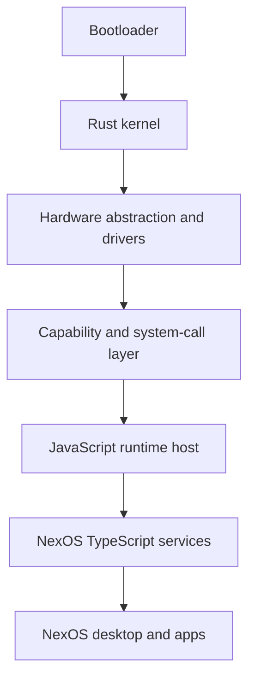

# Migration path toward a Rust kernel

NexOS v0.2 does not claim that Electron is a kernel. The current product is a desktop environment with OS-like services. A bootable system requires a boot chain, kernel, drivers, memory and process isolation, a system-call ABI, persistent storage drivers, a compositor, and a JavaScript/TypeScript runtime.

## Target layers

## Preserve the contract, replace the host

The current `NexOSBridge` and service methods define a useful behavior contract. Today they travel over Electron IPC. Renderer-facing code should not know whether a request ultimately reaches Electron, a user-space Rust daemon, or a kernel syscall.

v0.2 introduces the first concrete seam. `@nexos/runtime` defines a bounded binary frame and request/response client/server, and `SystemInformationService` consumes a `RuntimeHostAdapter`. `native/runtime-protocol` is a dependency-free `no_std` Rust crate that encodes and decodes the same header. The prototype is intentionally not connected to the Electron release or described as a kernel.

| Header field     |    Size | Encoding                           |
| ---------------- | ------: | ---------------------------------- |
| Magic `NXOS`     | 4 bytes | Fixed ASCII                        |
| Protocol version | 2 bytes | Unsigned big-endian                |
| Frame kind       |  1 byte | `1` request, `2` response          |
| Reserved         |  1 byte | Zero                               |
| Request ID       | 4 bytes | Unsigned big-endian                |
| Payload length   | 4 bytes | Unsigned big-endian, maximum 1 MiB |

Likely adapters:

| Current implementation  | Transitional implementation           | Bootable implementation                        |
| ----------------------- | ------------------------------------- | ---------------------------------------------- |
| Electron main process   | Rust host daemon launched by Electron | Native service supervisor                      |
| `node:sqlite`           | Rust storage service using SQLite     | Filesystem/database service over block drivers |
| Node `os` summaries     | Rust host-info adapter                | Kernel/system telemetry syscalls               |
| Electron clipboard      | Brokered Rust desktop service         | Compositor clipboard protocol                  |
| Zustand window geometry | Same TypeScript policy                | Native compositor/window-server client         |
| Electron IPC            | Authenticated local IPC               | Capability handles and versioned syscalls      |

## Staged migration

### 1. Freeze and version service contracts (started)

Assign protocol versions to filesystem, application, process, user, permission, notification, and system-information operations. Add conformance tests that run against any adapter. Preserve structured error codes and bounded payloads.

### 2. Introduce ports and adapters (started)

Move host-specific work behind interfaces such as `StoragePort`, `SystemInfoPort`, `ClipboardPort`, and `PowerPort`. Keep policy in TypeScript services where practical. `RuntimeHostAdapter` and its Node implementation now cover system information; storage, clipboard, power, and identity remain future adapters.

### 3. Build a Rust companion service

Carry the existing system-information method over authenticated local IPC to a Rust daemon. Request IDs, a protocol version, and maximum frame sizes exist in the prototype; add handshake negotiation, peer authentication, cancellation, deadlines, replay handling, and capability-scoped sessions. Compare responses with the Node implementation in CI.

### 4. Move storage and identity services

Move database ownership to Rust so only one process can mutate durable state. Add encrypted per-user keys backed by the host credential store during the desktop phase. Keep migrations transactional and support rollback from backups.

### 5. Isolate application runtimes

Run each third-party app in its own restricted runtime with a manifest-derived capability set. The runtime gets opaque handles, not host paths or global IPC endpoints. Keep the declarative v1 runtime as the lowest-risk package tier.

### 6. Create the kernel prototype

Build a separate Rust workspace and emulator-only boot path. Establish serial logging, physical/virtual memory management, interrupts, a scheduler, user mode, a minimal VFS, and capability-oriented syscalls. Do not couple the stable NexOS release build to the prototype.

### 7. Add hardware and graphics incrementally

Target a narrow virtual machine profile first (for example UEFI plus virtio devices). Bring up storage, input, networking, and framebuffer/virtio-gpu drivers before a compositor. Hardware support must be explicit and testable, not implied by running in Electron.

### 8. Host the TypeScript layer

Embed or port a memory-safe JavaScript runtime in user space. Provide only generated bindings to capability APIs. The NexOS services and shell can then migrate from Electron/Chromium to the new compositor/runtime in slices.

## ABI and security principles

- Keep the kernel ABI small, versioned, and transport-neutral.
- Prefer capability handles to global names and ambient authority.
- Never pass unchecked pointers, paths, or unbounded buffers across the boundary.
- Separate kernel mechanisms from user-space policy.
- Isolate drivers where feasible and treat DMA as privileged.
- Make updates atomic and recoverable with a known-good boot slot.
- Sign boot artifacts, system packages, and production updates.
- Use reproducible builds and machine-readable software bills of materials.

## What remains TypeScript

Desktop composition, settings UX, app discovery, much of the virtual filesystem policy, the SDK, manifests, search, notifications, and applications can remain TypeScript if their dependencies are injected through stable ports. Scheduling, memory management, driver access, page-table control, interrupts, and syscall enforcement belong below TypeScript.

## Exit criteria for calling NexOS bootable

NexOS should be described as a bootable OS only when it boots without a host OS/hypervisor-provided user environment, enters user mode under its own kernel, provides isolated processes and persistent storage through its own system services, and runs the NexOS desktop through a documented system-call/runtime boundary. Until then, releases should remain explicit about the Electron host.
